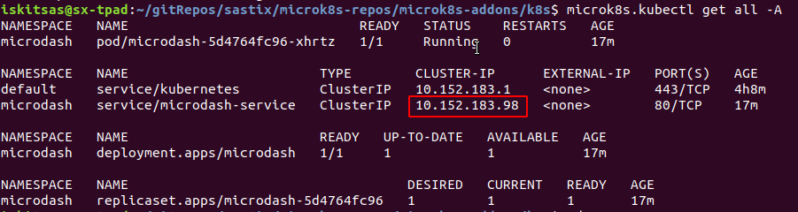

# Microdash | a MicroK8s dashboard 

[MicroK8s](https://kubernetes.io/) provides a local [Kubernetes](https://kubernetes.io/) that you can manage through the CLI. This project provides Microdash, a web console over the most common operations a developer will need when interacting with MicroK8s.


## Requirements

You must have MicroK8s running:
```
sudo snap install microk8s --edge --classic
```

## Run in development mode
The project uses angular and yarn. In order to run ('ng serve' mode) MicroDash at 4200 port run the following from a shell:
```
cd microk8s-webconsole/ui
yarn
yarn start
```

Press Ctr+C to kill the running server in your shell

In case you want to run it as a background service, locate start.sh under scripts folder and run it from a shell:
```
cd microk8s-webconsole/ui
yarn
cd ../../scripts
./start.sh
```
You can stop the service by finding the process and kill it. From a shell run:
```
ps -ef | grep "ng serve"
kill <process_id>
```

## (Build and) Run in production mode using Docker
In this project you can find 2 Dockerfiles to build the angular code and run from an NGINX container. The [first](docker/ui/ubuntu/Dockerfile) is based on an ubuntu image and the [second](docker/ui/alpine/Dockerfile) on an alpine.

Building the code:
```
# navigate to project root folder and run
# Using the ubuntu image:
docker build -t 'sastix/microdash:1.0' -f docker/ui/ubuntu/Dockerfile .

#Using the alpine image:
docker build -t 'sastix/microdash:1.0-slim' -f docker/ui/alpine/Dockerfile .
```
For everything to work smoothly you have to enable the "magic ip" on your host, or run the Docker container having enabled the access to your network host. 

After your image is created, run the container:
```
# ~~ Using the 'magic ip' ~~
sudo ifconfig lo:1 10.0.2.2 up
# ubuntu image
docker run -p 80:80 sastix/microdash:1.0
# alpine image
docker run -p 80:80 sastix/microdash:1.0-slim
```

Using network host (and not magic ip): Configure and map your own NGINX config file through docker volume. Under /microk8s-addons/docker/ui/nginx/nginx.conf change:
```
proxy_pass https://10.0.2.2:25000/;
```
to (or your local ip):
```
proxy_pass https://127.0.0.1:25000/;
```
and run:
```
# ubuntu
docker run -p 80:80 --network host -v /<path-to-project>/microk8s-addons/docker/ui/nginx/nginx.conf:/etc/nginx/conf.d/microdash.conf sastix/microdash:1.0
# alpine
docker run -p 80:80 --network host -v /<path-to-project>/microk8s-addons/docker/ui/nginx/nginx.conf:/etc/nginx/conf.d/microdash.conf sastix/microdash:1.0-slim
```
## Deploy MicroDash in MicroK8s 


Under k8s folder you can deploy-in-microk8s.sh. Open a shell and run it:
```
cd k8s
./deploy-in-microk8s.sh
```

Get all namespaces to find the ip:
```
microk8s.kubectl get all -A
```


Point to this ip in a browser url, eg:
http://10.152.183.98

# Links
 - [Kubernetes](https://kubernetes.io/)
 - [MicroK8s project on github](https://github.com/ubuntu/microk8s)
 - [MicroK8s project](https://microk8s.io)

