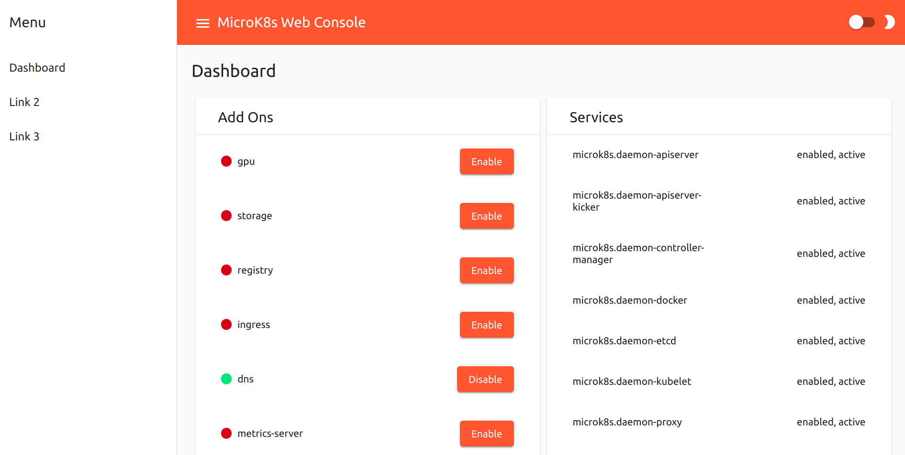

# MicroK8s Web Console

 provides a local  that you can manage through the CLI. This project provides a web console over the most common operations a developer will need when interactig with MicroK8s.



## Requirements

You have to have MicroK8s running:
```
sudo snap install microk8s --edge --classic
```

The project uses angular and nest on node. To get dependencies installed you should do something along these lines:
```
sudo apt-get install npm
(cd microk8s-webconsole/server; npm install)
(cd microk8s-webconsole/ui; npm install)
```


## Start and stop the services
To start the web console run the following providing your sudo credentials:
```
scripts/start.sh
```

Two services processes will start on the background. The first one is the UI and the second is the backend server. Note the back end server runs with root privileges. Point your browser to http://localhost:4200.


To stop the web console you need to first spot the node processes and kill them:
```
ps -ef | grep microk8s-webconsole
```

And then:
```
kill <microk8s-webconsole/ui>
sudo kill <microk8s-webconsole/server>
```


# Links
 - [Kubernetes](https://kubernetes.io/)
 - [MicroK8s project on github](https://github.com/ubuntu/microk8s)
 - [MicroK8s project](https://microk8s.io)

